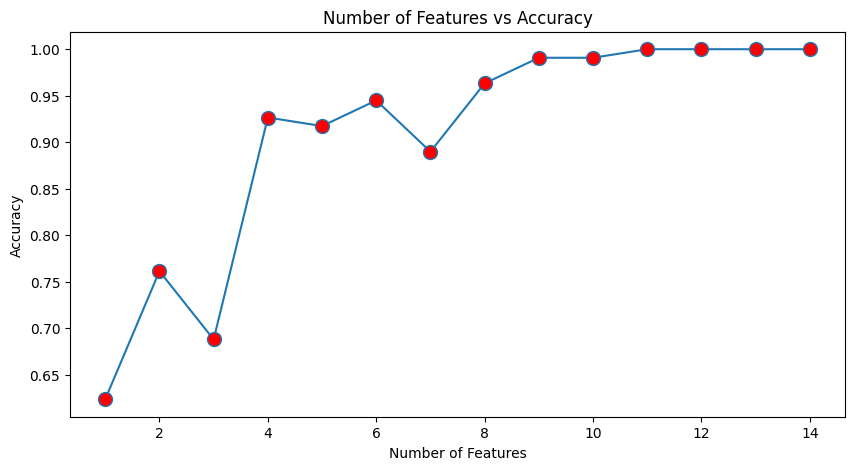

# Housing Price Prediction

## By: Surya Malik and Cierra Church

---

# Objective

### **Goal**:
- Predict housing prices based on features such as:
  - Area, bedrooms, bathrooms, and more.

### **Why is this important?**
- **For Renters**: Ensure fair property pricing.
- **For Landlords/Homeowners**: Price properties competitively.

### **Challenges**
- **Limited Dataset**: Only 545 samples.
- **Overfitting Risk**: Especially for complex models.

---

# Dataset Overview

### **Features**
1. Area of the house (numerical)
2. Number of bedrooms, bathrooms, and stories (numerical)
3. Main road access, guestroom, basement (boolean)
4. Hot water heating, air conditioning (boolean)
5. Parking spots (numerical)
6. Furnishing status (categorical → one-hot encoded)

### **Target Variable(s)**
- **Price**: Continuous variable.
- **Low, Medium, High, Preium**: Class.

---

# Models Implemented

1. **Linear Regression**
2. **Polynomial Regression**
3. **Ridge and Lasso Regression**
4. **Decision Tree Regressor**
5. **Random Forest Regressor**
6. **Neural Networks**

**FOR CLASSIFICATION**

7. **Logistic Regression**
8. **Support Vector Machines**
9. **Decision Tree Classifier**
10. **Random Forest Classifier**

---

# Price Distribution


### Key Observations:
- Prices are highly skewed.
- Most properties fall within the low-to-medium price range.
- Outliers may influence predictions.

---

# Preprocessing Steps

### **Key Preprocessing Steps**
1. **Handle Categorical Data**:
   - One-hot encoding for `furnishingstatus`.
2. **Normalize Features**:
   - Used `StandardScaler` for all numerical features.
3. **Split Data**:
   - **80% training**, **20% testing** split.

---

# **One-Hot Encoding for Furnishing Status**

```python
# Data Preprocessing Steps
from sklearn.model_selection import train_test_split
from sklearn.preprocessing import StandardScaler
import pandas as pd

# Load dataset
data = pd.read_csv('housing.csv')

# One-hot encoding for categorical features
data = pd.get_dummies(data, columns=['furnishingstatus'],drop_first=False).astype(int)
data['furnishingstatus_furnished'] = data['furnishingstatus_furnished'].replace([True, False], [1, 0]).astype(int)
data['furnishingstatus_semi-furnished'] = data['furnishingstatus_semi-furnished'].replace([True, False], [1, 0]).astype(int)
data['furnishingstatus_unfurnished'] = data['furnishingstatus_unfurnished'].replace([True, False], [1, 0]).astype(int)

# Splitting the data
X = data.drop('price', axis=1)
y = data['price']
X_train, X_test, y_train, y_test = train_test_split(X, y, test_size=0.2, random_state=42)

# Standardizing numerical features
scaler = StandardScaler()
X_train = scaler.fit_transform(X_train)
X_test = scaler.transform(X_test)
```

---

# Preprocessing: Feature Coefficients of Linear Model


---

### Observations:
- Linear models identified features like "Area" as significant.
- Feature importance will vary across models.

---

# Linear Regression Results


---

### Results:
- **R²: 0.68**
- Captures only 68% of variance in the data.
- Performs moderately well but struggles with non-linearity.

---

# Polynomial Regression Results


---

### Results:
- **Degree: 2 | R²: 0.79**
- Fits the data better but may suffer from overfitting, especially with such a small dataset.

---

# Ridge and Lasso Regression

### Why Regularization?
- Reduces overfitting by penalizing large coefficients.

### Results
- Ridge Regression: **R² = 0.69**
- Lasso Regression: **R² = 0.69**

---

# Feature Importance: Tree Models


---

### Observations:
- "Area" dominates in regression models.
- Models like Random Forest capture non-linear relationships effectively.

---

# Feature Engineering

### **New Features Created**
1. **`area_per_bedroom`**: Area / Number of Bedrooms.
2. **`area_per_bathroom`**: Area / Number of Bathrooms.

### **Findings**
- Adding these features slightly decreased overfitting.
- Dropping irrelevant features also improved accuracy.

---

# Decision Tree Regressor

### Performance:
- Baseline Accuracy: **0.20**
- After tuning: **0.62**

---

# Number of Features to Consider when Looking for the Best Split vs Accuracy 


---

# Random Forest Regressor

### Performance:
- Default Accuracy: **0.56**
- After tuning: **0.63**

---

# Number of Trees in the Forest vs Accuracy 


---


# Neural Networks: Architectures and Results


---

# Insights:
- Neural networks struggled with overfitting and the small dataset.
- Even with more complex models, it seemed as though performance did not improve.
- Though we utilized Early Stopping and Dropout layers, our model still seemed to overfit.
- In order to improve our neural network, we should experiment with data augmentation and various, less complex, network architectures.

---

# Architecture 1
1. Simple 2-layer NN → **R²: -4.77**


---

# Architecture 2
2. Improved 3-layer NN → **R²: 0.60**


---

# Architecture 3
3. Complex 5-layer NN → **R²: 0.57**


----

# Transition to Classification

### **Why Switch to Classification?**
- Regression struggled with overfitting.
- Classification simplifies the problem.

### **Classes**
- Low, Medium, High, Premium.
- Used `pandas.qcut()` to categorize prices.

```python
price_categories = pd.qcut(y, q=4, labels=['Low', 'Medium', 'High', 'Premium'])
y_categorical = price_categories.astype('object')

# Split the data again but now with categorical target
X_train_log, X_test_log, y_train_log, y_test_log = train_test_split(
    X, y_categorical, test_size=0.2, random_state=42
)
```

---

# **Logistic Regression**
- **Accuracy**: **93.58%**
- Severe overfitting despite regularization.


---

# **Logistic Regression Confusion Matrix**


- The diagonal values show correct predictions for each category
- Off-diagonal values show misclassifications

---

**Low price category:**
- Accuracy: 91.7%
- Misclassification Rate: 8.3%

**Medium price category:**
- Accuracy: 100.0%
- Misclassification Rate: 0.0%

**High price category:**
- Accuracy: 84.2%
- Misclassification Rate: 15.8%

**Premium price category:**
- Accuracy: 94.1%
- Misclassification Rate: 5.9%

---

# **Logistic Regression with Lasso Performance**
**Accuracy: 0.8257**

Classification Report: (Precision, Recall, F1-Score, Support)

        High       0.72      0.54      0.62        24
         Low       0.91      1.00      0.96        32
      Medium       0.69      0.58      0.63        19
     Premium       0.85      1.00      0.92        34
    accuracy                           0.83       109

    macro avg      0.79      0.78      0.78       109
    weighted avg   0.81      0.83      0.81       109

---

# **Logistic Regression with Ridge Performance**
**Accuracy: 0.3945**

Classification Report: (Precision, Recall, F1-Score, Support)

        High       0.25      0.25      0.25        24
         Low       0.75      0.19      0.30        32
      Medium       0.00      0.00      0.00        19
     Premium       0.40      0.91      0.56        34
    accuracy                           0.39       109

    macro avg      0.35      0.34      0.28       109
    weighted avg   0.40      0.39      0.32       109

---

# **Support Vector Machines**
- Linear Kernel: **100% accuracy** → Overfit.
- Polynomial Kernel: **95.41% accuracy**.

### Non-Linear Support Vector Machine Performance:
**Accuracy: 0.9541**

Classification Report: (Precision, Recall, F1-Score, Support)

        High       1.00      0.92      0.96        24
         Low       0.91      1.00      0.96        32
      Medium       1.00      0.84      0.91        19
     Premium       0.94      1.00      0.97        34
    accuracy                           0.95       109

    macro avg      0.96      0.94      0.95       109
    weighted avg   0.96      0.95      0.95       109

---

# **Support Vector Machine Confusion Matrix (Non-Linear Kernel)**


---

# **Decision Tree Classifier**
- Tuned Accuracy: **83.49%**
- Positive correlation with features.



---

### **Random Forest Classifier**
- **50 Trees**: Accuracy: **100%** → Overfit.


---

# **Error Metrics**
1. Mean Absolute Error (MAE)
2. Mean Squared Error (MSE)
3. Root Mean Squared Error (RMSE)
4. R² Score

---

# **Scoring Metrics**
1. Accuracy
2. Precision, Recall, F1-score
3. Confusion Matrix
4. Classification Report

---

# **Validation Metrics**
1. Cross-Validation
2. Grid Search and Randomized Search

---

# Results Summary

| **Model**                | **R² / Accuracy** | **Notes**                     |
|---------------------------|-------------------|--------------------------------|
| Linear Regression         | R²: 0.68         | Moderate.                     |
| Polynomial Regression     | R²: 0.79         | Overfitting suspected.        |
| Ridge/Lasso Regression    | R²: 0.69         | Regularization improved fit.  |
| Decision Tree Regressor   | R²: 0.62         | Overfitting reduced w/ tuning.|
| Random Forest Regressor   | R²: 0.63         | Best regression model.        |
| Logistic Regression       | Acc: 93.58%      | Severe overfitting.           |
| SVM (Linear Kernel)       | Acc: 100%        | Overfit.                      |
| SVM (Poly Kernel)         | Acc: 95.41%      | Improved generalization.      |
| Random Forest Classifier  | Acc: 100%        | Overfit.                      |

---

# Conclusions

1. **Best Model**:
   - Regression: Random Forest Regressor.
   - Classification: SVM with Polynomial Kernel.

2. **Challenges**:
   - Overfitting is a major concern for most models.
   - Dataset size limits generalization.

3. **Future Work**:
   - Collect more data.
   - Explore advanced ensemble techniques and feature engineering.

---

# Thank You!

### Questions?
